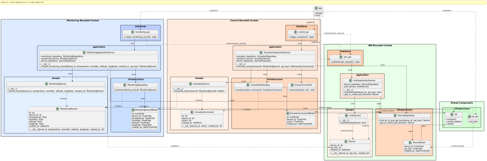
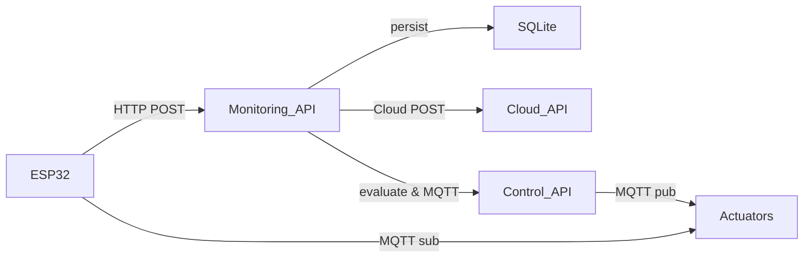

# AgroRoute Edge Service

Este repositorio contiene el **Edge Service** de AgroRoute, implementado en Python con FastAPI y SQLite, que recibe telemetría del dispositivo IoT y orquesta la lógica de control.

<p align="center">
  
</p>

## 🗂 Estructura de carpetas

```text
.
├── control
│   ├── application/services.py       # Lógica de aplicación: orquesta creación y ejecución de comandos
│   ├── domain/
│   │   ├── entities.py              # ActuationCommand
│   │   └── services.py              # ActuationService (reglas de negocio)
│   └── infrastructure/
│       ├── actuator_controller.py   # Adapter para MQTT/GPIO
│       ├── models.py                # Peewee ActuationCommandModel
│       └── repositories.py          # ActuationRepository
│   └── interfaces/services.py       # FastAPI router `/api/v1/control`
│
├── iam
│   ├── application/services.py      # AuthApplicationService
│   ├── domain/services.py           # AuthService, Device entity
│   ├── infrastructure/
│   │   ├── models.py                # Peewee DeviceModel
│   │   └── repositories.py          # DeviceRepository
│   └── interfaces/services.py       # FastAPI router `/iam`
│
├── monitoring
│   ├── application/services.py      # MonitoringRecordApplicationService (incluye Cloud client)
│   ├── domain/services.py           # MonitoringRecordService
│   ├── infrastructure/
│   │   ├── cloud_client.py          # CloudMonitoringClient (POST a API externa)
│   │   ├── models.py                # Peewee MonitoringRecordModel
│   │   └── repositories.py          # MonitoringRecordRepository
│   └── interfaces/services.py       # FastAPI router `/api/v1/monitoring`
│
├── shared/infrastructure/database.py # Inicializa SQLite y crea tablas
├── docs/class-diagram.puml           # Diagrama de clases DDD (PlantUML)
├── main.py                           # Arranque de FastAPI y DB init
├── requirements.txt                  # Dependencias Python
└── agroroute_edge_service.db         # Base SQLite (se genera)
```

## ⚙️ Instalación y requisitos

1. Clona este repositorio y entra en la carpeta:

   ```bash
   git clone <repo-url>
   cd AgroRoute-edge
   ```
2. Crea y activa un entorno virtual:

   ```bash
   python3 -m venv .venv
   source .venv/bin/activate
   ```
3. Instala las dependencias:

   ```bash
   pip install -r requirements.txt
   ```

### Dependencias clave

* `fastapi`, `uvicorn`       : Servidor API
* `peewee`                   : ORM SQLite
* `python-dateutil`          : Parseo de fechas ISO
* `paho-mqtt`                : Cliente MQTT para actuadores
* `requests`                 : Cliente HTTP para Cloud
* `python-dotenv`            : Cargar variables `.env`

## 🗄 Base de datos local (SQLite)

El servicio utiliza SQLite para persistir **Devices**, **MonitoringRecords** y **ActuationCommands**. La BD se crea en `agroroute_edge_service.db`.

Para inspeccionarla, instala el cliente SQLite3 y luego:

```bash
sudo apt install sqlite3       # si no lo tienes
sqlite3 agroroute_edge_service.db
```

En el prompt de sqlite3 puedes listar tablas:

```sql
.tables
.schema devices
.schema monitoring_records
.schema actuation_commands
```

## 🔧 Configuración y variables de entorno

Crea un archivo `.env` en la raíz con:

```
CLOUD_MONITORING_ENDPOINT=https://api.miempresa.com/monitoring/data-records
```

El servicio carga `.env` automáticamente (gracias a `python-dotenv`).

## ▶️ Ejecución

Levanta la API, inicializa la base y crea el dispositivo de prueba:

```bash
uvicorn main:app --host 0.0.0.0 --port 8000 --reload
```

> Si utilizas Docker o despliegas en otro host, ajusta `--host` y `--port` según tu entorno.

### Ejemplo de llamada al endpoint de Telemetría

```bash
curl -X POST http://localhost:8000/api/v1/monitoring/data-records \
  -H "Content-Type: application/json" \
  -H "X-API-Key: test-api-key-123" \
  -d '{
    "device_id": "agro-route-001",
    "temperature": 22.5,
    "humidity": 48.0,
    "latitude": -12.0464,
    "longitude": -77.0428,
    "created_at": "2025-06-18T20:04:35.998179Z"
}'
```

### Rutas disponibles

* **IAM** (`/iam`)

  * `POST /iam/authenticate_request` (Dependecia FastAPI)
* **Monitoring** (`/api/v1/monitoring`)

  * `POST /api/v1/monitoring/data-records`
    Crea un registro de telemetría y envía a la nube.
* **Control** (`/api/v1/control`)

  * `POST /api/v1/control/execute`
    Ejecuta actuadores según `monitoring_id` y publica comandos MQTT.

Todas requieren header `X-API-Key: test-api-key-123`.

## 📈 Flujo de datos



---
## 🛰️ Configuración de MQTT con Mosquitto

### 1. Instalación de Mosquitto (Ubuntu)

Instala el broker Mosquitto y sus herramientas de línea de comandos:

```bash
sudo apt update
sudo apt install mosquitto mosquitto-clients
```

Habilita el servicio para que inicie automáticamente y verifica su estado:

```bash
sudo systemctl enable mosquitto
sudo systemctl start mosquitto
sudo systemctl status mosquitto
```

---

### 2. Habilitar conexiones externas (toda la red)

Edita el archivo de configuración principal:

```bash
sudo nano /etc/mosquitto/mosquitto.conf
```

Agrega al final del archivo:

```conf
listener 1883
allow_anonymous true
log_dest file /var/log/mosquitto/mosquitto.log
log_type all
connection_messages true
```

Reinicia Mosquitto para aplicar los cambios:

```bash
sudo systemctl restart mosquitto
```

Verifica que esté escuchando en el puerto 1883:

```bash
sudo netstat -tulnp | grep mosquitto
```

---

### 3. Escuchar mensajes MQTT (suscripciones)

**a. Todos los mensajes del dispositivo agro-route-001:**

```bash
mosquitto_sub -h localhost -t "agroroute/agro-route-001/#" -v
```

**b. Un solo actuador (ej. solo el ventilador):**

```bash
mosquitto_sub -h localhost -t "agroroute/agro-route-001/fan" -v
```

**c. Todos los tópicos del broker:**

```bash
mosquitto_sub -h localhost -t "#" -v
```

---

### 4. Publicar mensajes de prueba

```bash
mosquitto_pub -h localhost -t "agroroute/agro-route-001/fan" -m "ON"
mosquitto_pub -h localhost -t "agroroute/agro-route-001/heater" -m "OFF"
```
---


© 2025 AgroRoute
